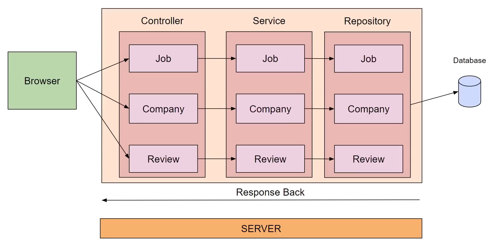

# Spring Boot Job Management Application

## Overview

This is a **Spring Boot monolithic REST API application** designed to manage **Companies, Jobs, and Reviews**.  
The application uses **PostgreSQL** for persistent storage and is **containerized using Docker** for easy setup and deployment.

All APIs are tested using **Postman**, and database administration is handled via **pgAdmin**.

---

## Architecture

- **Monolithic Spring Boot application**
- **RESTful APIs**
- **Layered architecture:**
  - Controller
  - Service
  - Repository
  - Model (Entity)

### Entity Relationships
- **Company → Jobs** (One-to-Many)
- **Company → Reviews** (One-to-Many)
- **Job → Company** (Many-to-One)

---

## Tech Stack

- **Java**
- **Spring Boot**
- **Spring Data JPA**
- **Hibernate**
- **PostgreSQL**
- **pgAdmin**
- **Docker**
- **Docker Compose**
- **Maven**
- **Tomcat Server**
- **Postman**

---

## API Endpoints

### Company APIs
| Method | Endpoint | Description |
|------|---------|-------------|
| GET | `/api/companies` | Get all companies |
| GET | `/api/companies/{id}` | Get company by ID |
| POST | `/api/companies` | Create a company |
| PUT | `/api/companies/{id}` | Update company |
| DELETE | `/api/companies/{id}` | Delete company |

---

### Job APIs
| Method | Endpoint | Description |
|------|---------|-------------|
| GET | `/api/jobs` | Get all jobs |
| GET | `/api/jobs/{id}` | Get job by ID |
| POST | `/api/jobs` | Create a job |
| PUT | `/api/jobs/{id}` | Update job |
| DELETE | `/api/jobs/{id}` | Delete job |

---

### Review APIs
| Method | Endpoint | Description |
|------|---------|-------------|
| GET | `/api/companies/{companyId}/reviews` | Get reviews for a company |
| POST | `/api/companies/{companyId}/reviews` | Add review |
| PUT | `/api/companies/{companyId}/reviews/{reviewId}` | Update review |
| DELETE | `/api/companies/{companyId}/reviews/{reviewId}` | Delete review |

---

## 🐳 Docker Support

This project is fully containerized using **Docker** and **Docker Compose**.

### Services
- **Spring Boot Application**
- **PostgreSQL Database**
- **pgAdmin**

